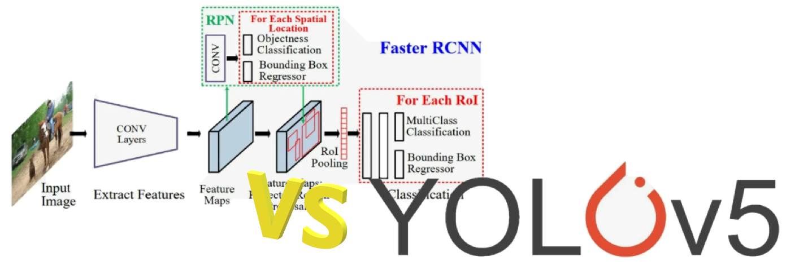
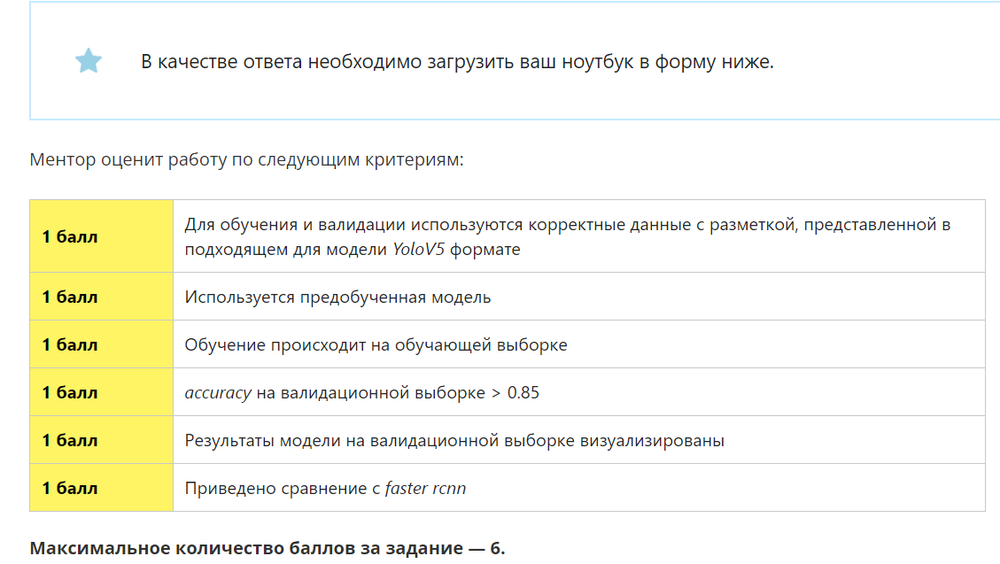
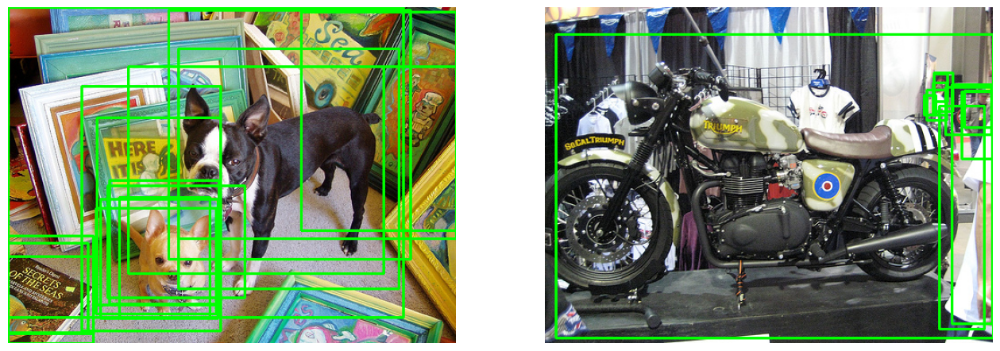

# Сравнение сверточных сетей Faster RCNN и Yolo5

Реализовано дообучение предобученных моделей Faster RCNN и Yolo5 на ограниченной выборке на 3, 90, 90 эпохах с визуализацей результата и рассчетом Accuracy.

## Задание
Обучите модель **yolov5**,  используя готовый `train.py` файл репозитория https://github.com/ultralytics/yolov5.git.

Для данной модели изображения и классы объектов должны находиться в папках images и labels, соответсвенно.

Протестируйте модель на валидациооной выборке и выведите на экран полученные изображения с bbox и классами объектов.

## Пример детектирования дообученных сетей
### Faster RCNN

### Yolo5

## Вывод
В ходе дообучения моделей на ограниченной выборке, получилась следующая статистика:
    
### Модели Faster RCNN.
    Обучение 3 эпох 24 сек, Accuracy = 0
    Обучение +90 эпох 11 мин 46 сек, Accuracy = 0.06
    Обучение +90 эпох 11 мин 41 сек, Accuracy = 0.09

### Модель Yolo5
    Обучение 3 эпох 46 сек, Accuracy = 0.06
    Обучение +90 эпох 5 мин 40 сек, Accuracy = 0.73
    Обучение +90 эпох 7 мин 48 сек, Accuracy = 0.97

**В результате можно сделать вывод, что на ограниченной выборке модель Yolo5 дообучается быстрее и дает более точные предсказания, чем Faster RCNN.**

## ОС и ПО:
Данный ноутбук разработан на ОС Windows 10.

Установленно ПО:
- NVIDIA Cuda 11.8
- NVIDIA графический драйвер 560.81
- NVIDIA Системное программное обеспечение PhysX 9.23.1019
- CUDNN 9.2
- Python 3.11

Так же установлены различные библиотеки для Python, подробнее в файле requirements.txt.
